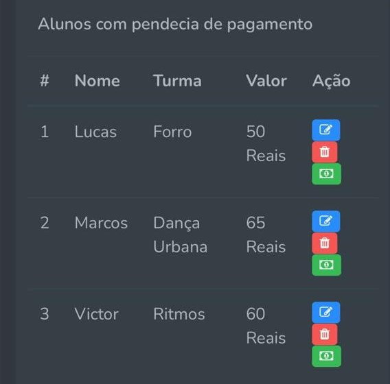
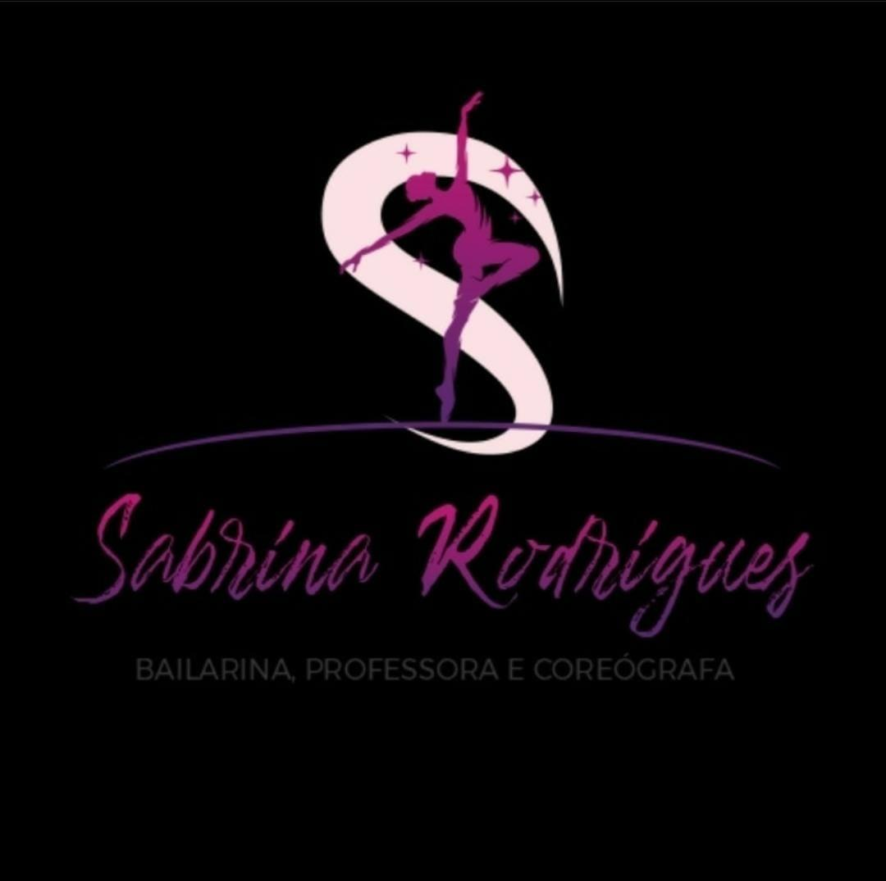
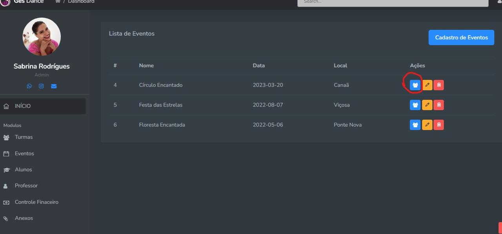
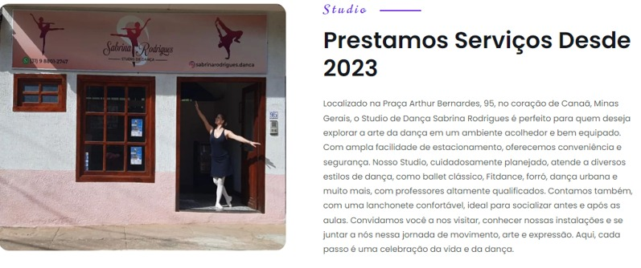
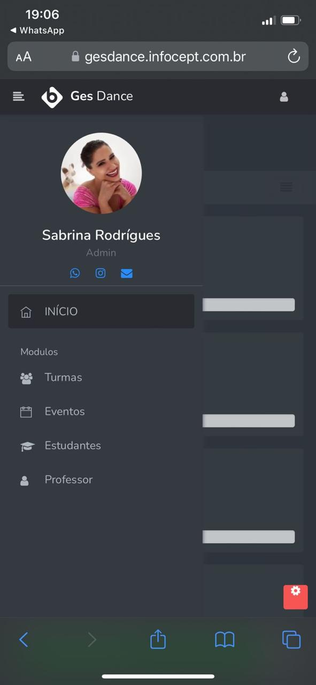
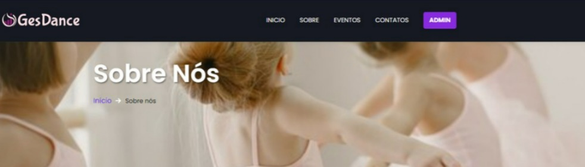

# Gesdance

## Descrição
O **Gesdance** é uma plataforma digital desenvolvida para otimizar a gestão de estúdios de dança e apoiar a tomada de decisão. O sistema foi criado para resolver os desafios da administração manual, oferecendo funcionalidades personalizadas para facilitar o controle de alunos, pagamentos e dados administrativos. A plataforma adota uma arquitetura moderna que separa a interface do usuário, a lógica de negócio e o gerenciamento de dados.



---

## Tecnologias Utilizadas



### 🔗 **Front-end**
- Figma (prototipagem)
- HTML, CSS, JavaScript
- Bootstrap
- jQuery
- Cypress (testes automatizados)
- Font Awesome (ícones)

### 🔒 **Back-end**
- PHP
- MySQL
- Apache (servidor local via WAMP Server)
- Laravel (framework PHP)
- PHPUnit (testes automatizados)
- PSR-2 (padrão de codificação PHP)

### ⚙️ **Arquitetura**
- Modelo MVC (Model-View-Controller)

---

## 🎯 Funcionalidades



- Cadastro de alunos
- Gerenciamento de pagamentos e controle de pendências
- Armazenamento e organização de dados em banco de dados relacional
- Interface amigável e intuitiva para usuários

---

## 🧪 Testes e Avaliação

O sistema passou por diversas fases de testes para garantir sua eficiência:



- ✅ Testes funcionais
- ✅ Testes de usabilidade
- ✅ Testes de desempenho
- ✅ Testes de segurança
- ✅ Testes de manutenção e atualização

---

## 🚧 Limitações do Projeto



O desenvolvimento enfrentou alguns desafios, como:

- Restrições técnicas e de recursos
- Tempo limitado para execução
- Equipe reduzida
- Dificuldades com usabilidade e segurança
- Restrições de desempenho

---

## 📚 Lições Aprendidas

Durante o desenvolvimento, a equipe percebeu a importância de:

- Flexibilidade na definição de requisitos
- Testes contínuos para garantir compatibilidade
- Gestão eficiente de tempo e recursos
- Coleta de feedback dos usuários
- Conformidade com regulamentações
- Manutenção de uma documentação clara e completa

---

## 🚀 Planos Futuros



- Implementação de um módulo de e-commerce para venda de produtos e serviços
- Expansão das funcionalidades de marketing com pacotes extras para estúdios
- Aprimoramento contínuo da experiência do usuário

---

## 📂 Como Começar

1. **Clone o repositório**
```bash
git clone https://gitlab.com/gesdance/gesdance.git
```

2. **Acesse o diretório do projeto**
```bash
cd gesdance
```

3. **Configure o ambiente**
- Instale o WAMP Server
- Configure o banco de dados no MySQL Workbench

4. **Suba o projeto**
```bash
git remote add origin https://gitlab.com/gesdance/gesdance.git
git branch -M main
git push -uf origin main
```

---

## 🤝 Contribuição

Contribuições são bem-vindas! Siga os seguintes passos:

1. Fork o projeto
2. Crie uma branch (`git checkout -b feature/nova-funcionalidade`)
3. Faça o commit (`git commit -m 'Adicionando nova funcionalidade'`)
4. Faça o push (`git push origin feature/nova-funcionalidade`)
5. Abra um Pull Request

---

## 👥 Autores

- Desenvolvedor 1: Lucas Rafael Arcanjo
- Desenvolvedor 2: Marcos Aurélio dos Santos
- Orientação: Prof.ª Dr.ª Cristiane Aparecida Lana

---

## 📜 Licença
Este projeto é de uso acadêmico e segue as diretrizes de uso justo para fins educacionais.

---

## 📈 Status do Projeto
O desenvolvimento do Gesdance está em andamento, com planos de expansão e melhorias futuras.
